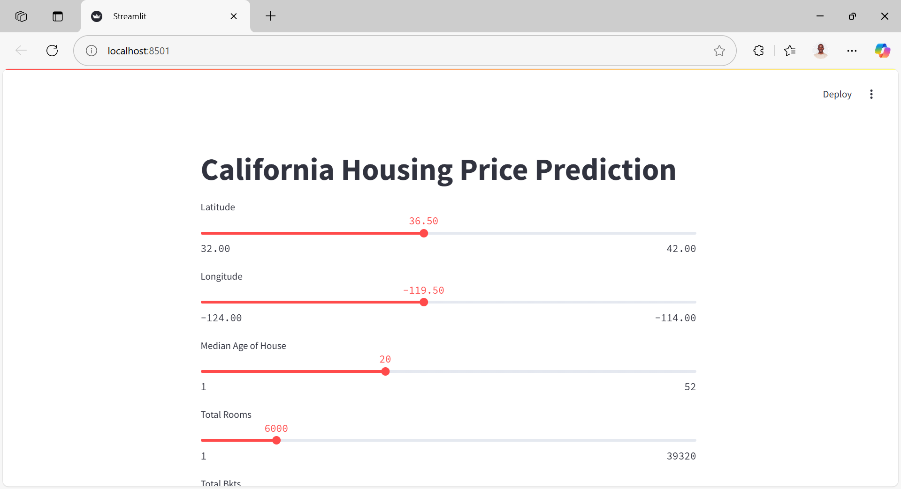

# 🏠 California Housing Price Predictor

This project is a machine learning web application built with **Streamlit** that predicts California median house values based on various housing features such as median income, location, and housing age. It uses the **California Housing Dataset** from `sklearn.datasets`.



## 🚀 Features

- 📊 Predict housing prices based on user-input features
- 🧼 Data preprocessing and pipeline using `scikit-learn`
- 🔁 Model training using linear regression and random forest
- 💾 Model saved and loaded using `joblib`
- 🧪 Notebook for exploratory data analysis
- ✅ Test script for model inference

## 🗂️ Project Structure

```
california-housing-price-predictor/
│
├── data/                         # (Optional) Raw data files
├── models/                       # Trained model storage
│   └── trained_model.pkl
├── notebooks/
│   └── data_exploration.ipynb    # Jupyter notebook for EDA
├── src/                          # Source code
│   ├── app.py                    # Streamlit app
│   ├── data_preprocessing.py     # Data loading and cleaning
│   ├── feature_engineering.py    # Preprocessing pipeline
│   ├── model_evaluation.py       # Evaluation logic
│   ├── model_training.py         # Training logic and hyperparam tuning
│   └── test.py                   # Model input size testing script 
├── images/
│   └── screenshot.png            # Web app screenshot
├── LICENSE
├── README.md
└── venv/                         # Python virtual environment (excluded in .gitignore)
```

## 🧠 Input Features

| Feature             | Description                              |
|---------------------|------------------------------------------|
| `Latitude`          | Latitude of the house                    |
| `Longitude`         | Longitude of the house                   |
| `HouseAge`          | Median age of the house block            |
| `TotalRooms`        | Total number of rooms in the block       |
| `TotalBkts`         | Total number of "buckets" (e.g. houses)  |
| `Population`        | Total population in the block            |
| `Households`        | Total households in the block            |
| `MedInc`            | Median income (scaled in $10,000s)       |
| `AveBedrms`         | Average number of bedrooms               |

Some features like `AveRooms` and `AveOccup` are derived.

## ⚙️ Installation

```bash
# Clone the repo
git clone https://github.com/justkimtai/california-housing-price-predictor.git
cd california-housing-price-predictor

# Create a virtual environment
python3 -m venv venv
source venv/bin/activate

# Install dependencies
pip install -r requirements.txt
```

---

## 🏃 Running the App

```bash
cd src
streamlit run app.py
```

---

## 📈 Training the Model

```bash
python3 src/model_training.py
```

---

## 📊 Exploratory Data Analysis

Open the notebook:

```bash
jupyter notebook notebooks/data_exploration.ipynb
```

## 🧪 Model Testing

Run inference script or test with Streamlit interface.

## 📝 License

This project is licensed under the terms of the MIT license.

## 🤝 Credits

This project was inspired by [DigitalOcean tutorials](https://www.digitalocean.com/community/tutorials) and built as part of my machine learning learning journey.

## 📩 Contact

Feel free to connect with me on [X (Twitter)](https://x.com/justkimtai) or [email](mailto:justkimtai@gmail.com) me for collaboration, freelance work, or opportunities!

> Built with ❤️ by [Justus Kimtai](https://github.com/justkimtai)
